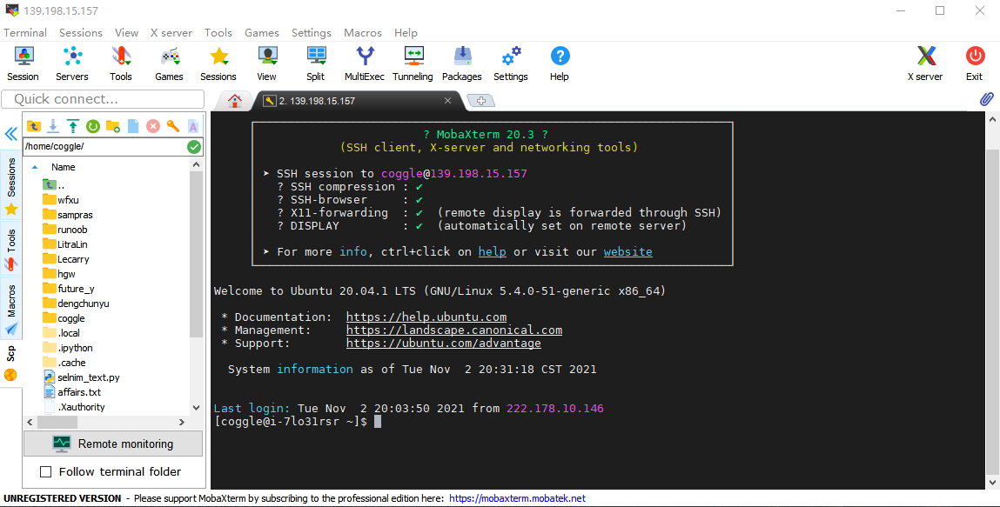
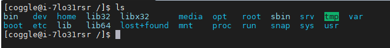

# 任务1：使用命令行登录指定的Linux环境
任务要点：ssh登录、密码输入、环境配置
步骤1：配置本地登录环境
本地是win10系统，使用的是MobaXterm这款SSH工具
步骤2：登录Linux系统



# 任务2：在目录下创建文件夹、删除文件夹
任务要点：创建文件夹、创建文件、删除文件、删除文件夹

步骤1：学习[Linux的目录结构](https://www.runoob.com/linux/linux-system-contents.html)
```
cd /
ls
```


步骤2：学习[Linux的文件和目录管理](https://www.runoob.com/linux/linux-file-content-manage.html)

常见的处理目录的命令：
```
ls（英文全拼：list files）: 列出目录及文件名

cd（英文全拼：change directory）：切换目录

pwd（英文全拼：print work directory）：显示目前的目录

mkdir（英文全拼：make directory）：创建一个新的目录

rmdir（英文全拼：remove directory）：删除一个空的目录

cp（英文全拼：copy file）: 复制文件或目录

rm（英文全拼：remove）: 删除文件或目录

mv（英文全拼：move file）: 移动文件与目录，或修改文件与目录的名称
```

步骤3：在/home/coggle目录下，新建一个以你英文昵称（中间不要有空格哦）的文件夹A在文件夹A内部创建一个以coggle命令的文件夹B
```
mkdir leigang
cd leigang
mkdir coggle
```
步骤4：在B文件夹内创建一个空txt文件
```
cd coggle
vi 1.txt
```

步骤5：删除步骤4创建的文件
```
rm 1.txt
```
步骤6：删除文件夹B，然后删除文件夹A
```
cd ../
rmdir coggle
cd ../
rmdir leigang
```

# 任务3：在目录下下载文件、阅读文件

任务要点：下载文件、移动文件、阅读文件

步骤1：在home目录下，新建一个以你英文昵称（中间不要有空格哦）的文件夹A在文件夹A内部创建一个以coggle命令的文件夹B
```
mkdir leigang
cd leigang
mkdir coggle
cd coggle
```
步骤2：使用wget命令下载https://mirror.coggle.club/dataset/affairs.txt，到文件夹Bwget教程：https://www.cnblogs.com/pretty-ru/p/10936023.html
```
wget https://mirror.coggle.club/dataset/affairs.txt
```

步骤3：使用head、cat、tail命令阅读下载的文件。阅读文件基础教程：https://www.cnblogs.com/jixp/p/10833801.html
```
head -n 10 affairs.txt   # head:只看开头几行
cat affairs.txt          # cat:由第一行开始显示文件内容
tail -n 10 affairs.txt   # tail: 只看结尾几行
```

步骤4：在命令行使用ipython进入python3环境，并使用pandas读取下载的文件。
```python
import pandas as pd
txt = pd.read_csv('affairs.txt',header=None)
print(txt)
```

# 任务4：在目录下使用vi或vim编辑文件
任务要点：vi和vim使用

步骤1：学习Nano的使用，https://blog.csdn.net/junxieshiguan/article/details/84104912
```
nano nanopyton.py
```
步骤2：学习Vim的使用，https://www.runoob.com/linux/linux-vim.html
```
vi vipython.py
```
步骤3：分别使用Nano和Vim创建py文件，并输入以下内容，并运行Python
```python
#!/usr/bin/env python3
print('Hello World!')
```

# 任务5：在目录下创建py文件，并进行运行
任务要点：python的os和sys系统接口，文件接口

步骤1：学习python下os模块处理文件和目录的函数，https://www.runoob.com/python/os-file-methods.html
常用命令：
```
os.name——判断现在正在实用的平台
os.getcwd()——得到当前工作的目录
os.listdir()——指定所有目录下所有的文件和目录名
os.mkdir()——创建目录
os.path.isfile()——判断指定对象是否为文件
os.path.isdir()——判断指定对象是否为目录
os.rename(src, dst)——重命名文件或目录，从 src 到 dst
os.system()——执行shell命令
os.path.join(path, name)——连接目录和文件名
```
步骤2：学习python下sys模块和传参函数，https://www.runoob.com/python3/python3-module.html

```
1、import sys 引入 python 标准库中的 sys.py 模块；这是引入某一模块的方法。
2、sys.argv 是一个包含命令行参数的列表。
3、sys.path 包含了一个 Python 解释器自动查找所需模块的路径的列表。
```

步骤3：在home/coggle目录下，在你英文昵称（中间不要有空格哦）的文件夹中，新建一个test5.py文件，改程序可以使用os、sys模块完成以下功能：
功能1：打印命令行参数
```test5.py
import sys
for i in sys.argv:
   print(i)
```

- python3 test5.py 参数1 参数2


功能2：使用os模块打印/usr/bin/路径下所有以m开头的文件。
```
import os
import sys
path=sys.argv[1]
lsdir=os.listdir(path)

files = [i for i in lsdir if os.path.isfile(os.path.join(path,i))]

if files:
    for f in files:
        if f.startswith("m"):
            print(os.path.join(path, f))
```
- python3 test5.py /usr/bin/


# 任务6：在目录下创建py目录，并进行import导入任务要点：python代码模块化
步骤1：学习python模块化，https://www.runoob.com/python3/python3-module.html
```
import module1[, module2[,... moduleN]
from ... import * 
```

步骤2：在/home/coggle目录下在你英文昵称（中间不要有空格哦）的文件夹中创建affairs文件夹。
```
cd leigang
mkdir affairs
```

步骤3：编写test6.py和affairs.py完成以下功能：
功能1：affairs.py代码完成https://mirror.coggle.club/dataset/affairs.txt文件的读取，这里可以直接pd.read_csv('https://mirror.coggle.club/dataset/affairs.txt')来完成。这一部分建议写为函数。

功能2：test6.py可以导入affairs.py代码功能3：test6.py可以进行命令行解析，输出affairs.txt具体的第几行内容。

```python
# test6.py
import sys
from affairs import affairs
row=int(sys.argv[1])
txt=affairs.get_txt(row)
print(txt)
```

```python
# affairs
import pandas as pd

file = pd.read_csv('https://mirror.coggle.club/dataset/affairs.txt')

def get_txt(row):
    return file.loc[file.index == row - 1]
```

- python3 test6.py 10

